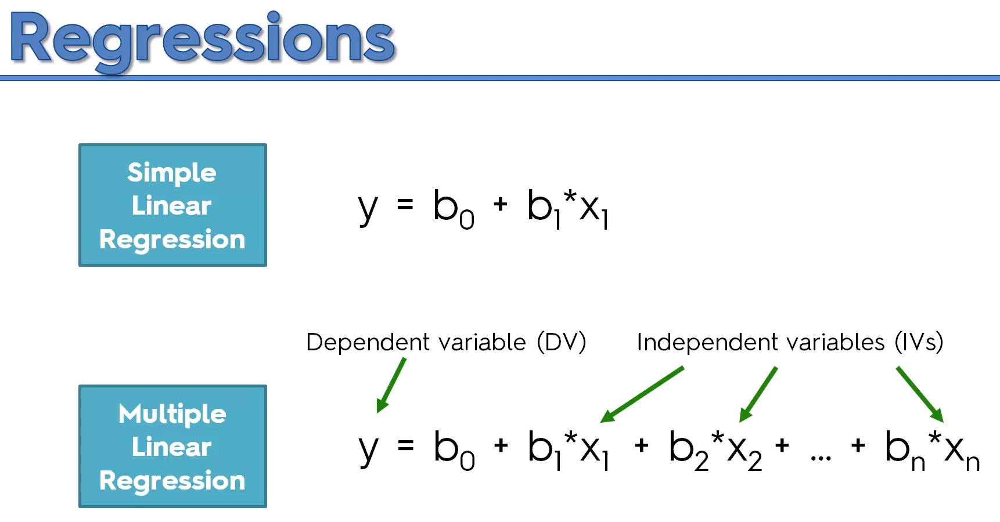
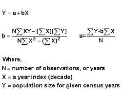
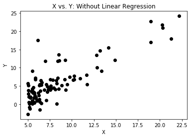
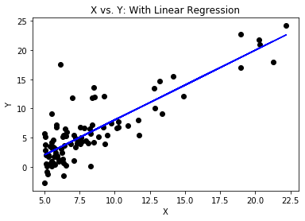

# What is Linear_Regression

Linear regression is a statistical model that examines the linear relationship:  
Simple Linear Regression or Multiple Linear Regression variables  
It models the relationship between a dependent variable and one or more independent variables.  
It is commonly used for predictive analysis.  
Examines two things:  
1. Does a predictor variable do a good job in predicting an outcome(dependent)variable.  
2. Which variable in particular are significant predictors of the outcome variable?  
# Formula 
The Simpliest form of the regression equation is y = a + b*x  
y = dependent variable  
x = independet varaible  
b = regression cofefficient  
a = constant

  
  

# Directions 
1. Plot the data with y as the output and x as the input And Plot  
  
2. Fit a linear regression model to this data.  
  
3. Predict the value for y when x is 27.  
[28.31612]  
4. Predict the value for y when x is 150.  
[175.0592]  
5. Would you want to use this regession model for predicting y when x is 150? Why ore why not?  
NO, 150 is not enough data.  
Linear regression needs a lot of training data so that it can fit the data correctly,  
avoiding under-fitting as well as over-fitting
